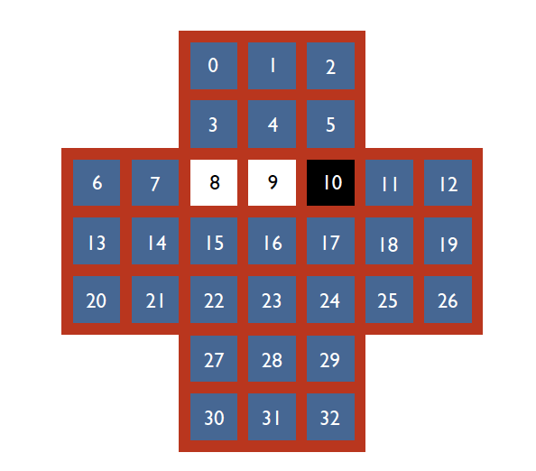
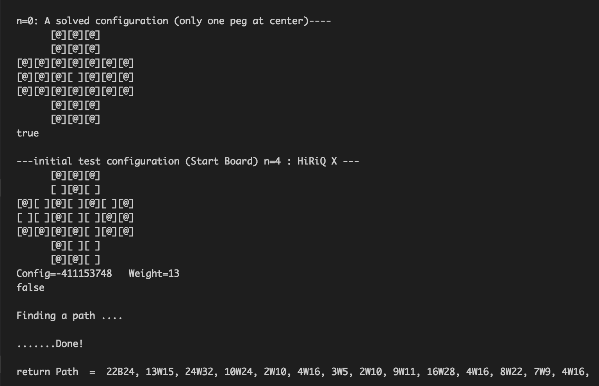

# Peg-Solitaire
A peg solitaire puzzle solver using A* search paradigms. The peg solitaire puzzle is a board with 33 white and black pixels. The objective is to make valid moves to only have one white pixel at the center of the board.

The peg solitaire puzzle is the same as the HiRiQ puzzle. The higherIQ pdf explains the valid moves to play the game and the 3-colouring of the puzzle.

**The 33-Peg Game Board**

**Starting (left) vs. Final (right) Board Configuration**

**Examples of valid one-move subsitutions**

**Sample solve session in terminal**

